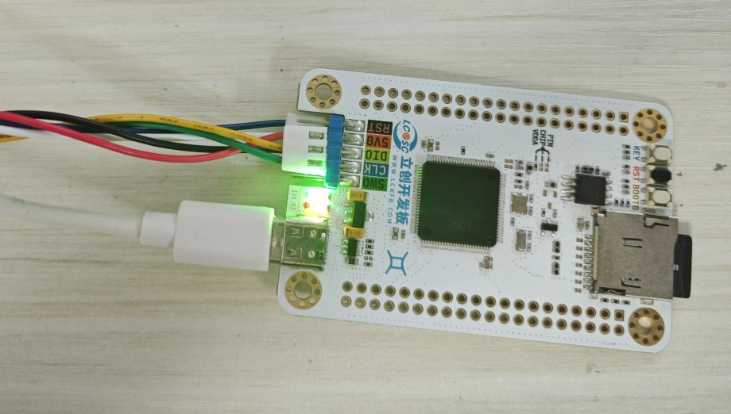

# 立创天空星HC32F4A0 开发板 BSP 说明

## 简介

简单驱动了一下立创天空星HC32F4A0

## 外设支持

本 BSP 目前对外设的支持情况如下：

| **板载外设**  | **支持情况** |               **备注**                |
| :------------ | :-----------: | :-----------------------------------: |
| UART
|      支持     |          使用 UART6                 |
| SD卡       |     支持     | SDIO0 |
| SPI flash |     支持     |           SPI1                   |
| LED | 支持 | PB2 |

## rtthread已经支持的外设（本例程usb没有使用官方协议栈，而是自己移植的cherrysb）

| **片上外设**  | **支持情况** |               **备注**                |
| :------------ | :-----------: | :-----------------------------------: |
| Crypto | 支持 | AES, CRC, HASH, RNG, UID |
| DAC | 支持 |  |
| ADC           |     支持     |                             |
| CAN           |     支持     |                                       |
| GPIO          |     支持     | PA0, PA1... PI13 ---> PIN: 0, 1...141 |
| PM | 支持 |  |
| Lptimer | 支持 |  |
| Hwtimer | 支持 |  |
| Pulse_encoder | 支持 |  |
| PWM | 支持 |  |
| RTC | 支持 | 闹钟精度为1分钟 |
| WDT | 支持 |  |
| I2C           |     支持     |              软件、硬件 I2C                 |
| QSPI | 支持 |  |
| SPI           |     支持     |              SPI1~6                   |
| SDIO | 支持 |  |
| UART V1 & V2         |     支持     |              UART1~10                 |
| USB | 支持 | cherryusb |



## 使用说明

使用说明分为如下两个章节：

- 开发板需要自己装一个格式化好的**sd卡**以及焊接完**rtc晶振**和**外部flash**


### 快速上手

本 BSP 为开发者提供 MDK5 和 IAR 工程，并且支持 GCC 开发环境。下面以 MDK5 开发环境为例，介绍如何将系统运行起来。

#### 硬件连接

使用Type-A to MircoUSB线连接开发板和PC供电。

#### 编译下载

双击 project.uvprojx 文件，打开 MDK5 工程，编译并下载程序到开发板。

> 工程默认配置使用板载 DAP 下载程序，点击下载按钮即可下载程序到开发板。

#### 运行结果

下载程序成功之后，系统会自动运行，观察开发板上LED的运行效果，绿色LED11会周期性闪烁。

USB虚拟COM端口默认连接串口1，在终端工具里打开相应的串口，复位设备后，可以看到 RT-Thread 的输出信息:

```
msh />rebootÿ
 \ | /
- RT -     Thread Operating System
 / | \     5.1.0 build Jun  9 2024 08:44:16
 2006 - 2024 Copyright by RT-Thread team
[I/SFUD] Found a Winbond flash chip. Size is 8388608 bytes.
[I/SFUD] w25q64 flash device initialized successfully.
[I/SFUD] Probe SPI flash w25q64 by SPI device spi10 success.
[D/FAL] (fal_flash_init:47) Flash device |             onchip_flash | addr: 0x00000000 | len: 0x00200000 | blk_size: 0x00002000 |initialized finish.
[D/FAL] (fal_flash_init:47) Flash device |                   w25q64 | addr: 0x00000000 | len: 0x00800000 | blk_size: 0x00001000 |initialized finish.
[I/FAL] ==================== FAL partition table ====================
[I/FAL] | name       | flash_dev    |   offset   |    length  |
[I/FAL] -------------------------------------------------------------
[I/FAL] | app        | onchip_flash | 0x00000000 | 0x00200000 |
[I/FAL] | filesystem | w25q64       | 0x00000000 | 0x00800000 |
[I/FAL] =============================================================
[I/FAL] RT-Thread Flash Abstraction Layer initialize success.
[I/FAL] The FAL MTD NOR device (filesystem) created successfully
[I/SDIO] SD card capacity 15187968 KB.
[I/SFUD] Filesystem initialized!
msh />[I/MAIN] File System initialized
[I/USB] ========== dwc2 udc params ==========
[I/USB] CID:12345678
[I/USB] GSNPSID:4f54400a
[I/USB] GHWCFG1:00000000
[I/USB] GHWCFG2:228ffd10
[I/USB] GHWCFG3:026080e8
[I/USB] GHWCFG4:3ff0a230
[I/USB] dwc2 fsphy type:1, hsphy type:0, dma support:2
[I/USB] dwc2 has 16 endpoints and dfifo depth(32-bit words) is 608, default config: 15 endpoints
[I/USB] =================================
[I/USB] fifo0 size:0040, offset:0080
[I/USB] fifo1 size:0040, offset:00c0
[I/USB] fifo2 size:0020, offset:0100
[I/USB] fifo3 size:0000, offset:0120
[I/USB] fifo4 size:0000, offset:0120
[I/USB] fifo5 size:0020, offset:0120
[I/USB] fifo6 size:0000, offset:0140
[I/USB] fifo7 size:0000, offset:0140
[I/USB] fifo8 size:0000, offset:0140
[I/USB] Open ep:0x02 type:2 mps:64
[I/USB] Open ep:0x81 type:2 mps:64

```

### 进阶使用

此 BSP 默认只开启了 GPIO 和 串口 6 的功能，更多高级功能需要利用 env 工具对 BSP 进行配置，步骤如下：

1. 在 bsp 下打开 env 工具。

2. 输入`menuconfig`命令配置工程，配置好之后保存退出。

3. 输入`pkgs --update`命令更新软件包。

4. 输入`scons --target=mdk5/iar` 命令重新生成工程。

## 联系人信息

-  [第九个下弦月]<https://github.com/jinsc123654/hc32f4a0_rtt>，Q群：<点击链接加入群聊【HC32F4A0】：https://qm.qq.com/q/zRRTmz6xjy>
